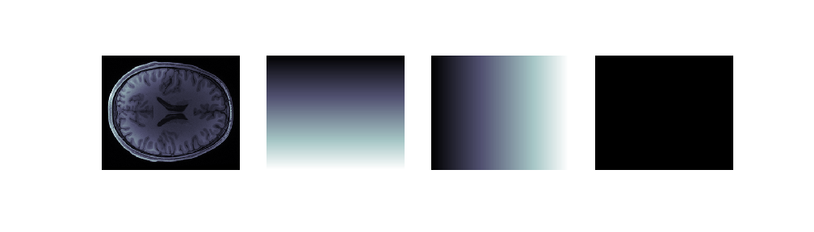
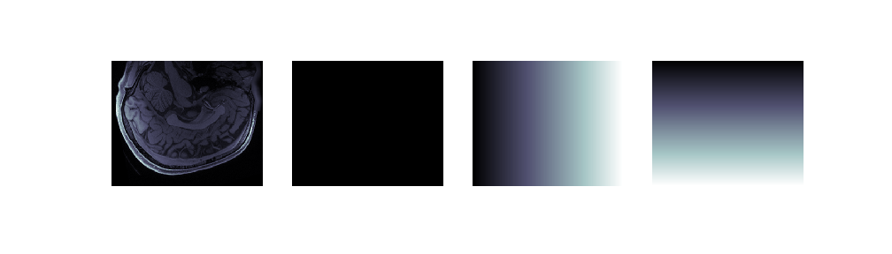
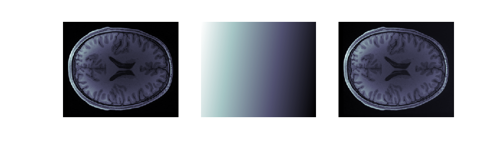
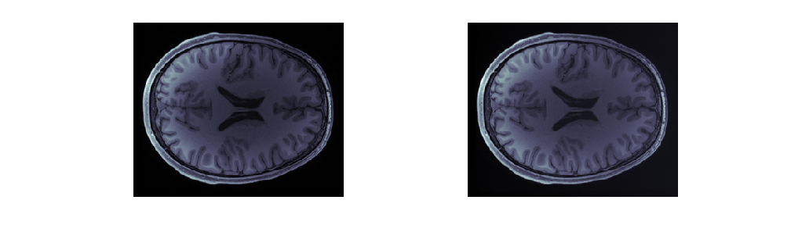
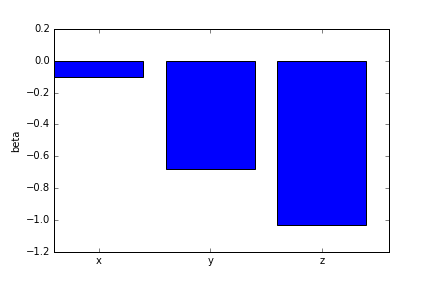
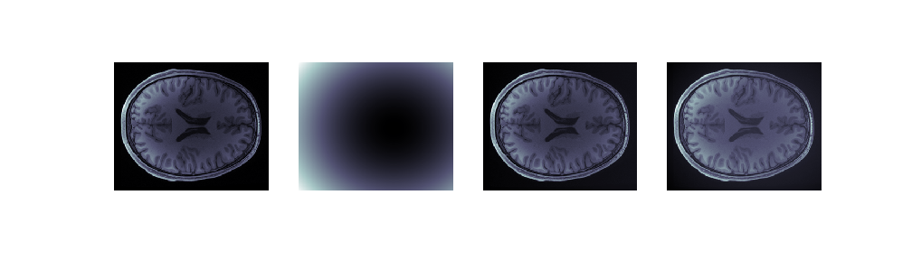
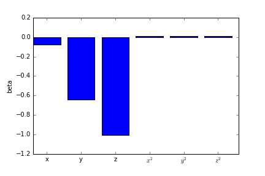

### Our data contains spatial bias

As we saw in the last part, MRI data often contains spatial biases. Some of
these may be due to physiological factors, such as differences in the T1
time-constant between different parts of the brain. But some of these represent
"nuisance factors" that should be eliminated as a first step in the analysis of
the image.

For example, it seems that the back of the head of this participant was closer
to the measurement coils, than the front of the head. We can also see that the
center of the brain is darker than the more external parts, also presumably due
to the distance of these parts from the measurement coils.

To model this spatial bias and remove it, we will assume that changes across the entire extent of the image are due to bias.

### Modeling linear bias and detrending

A linear spatial bias can be thought of as another 3D volume that coexists in
the same space as our data. This bias field can be modeled as a combination of
of biases on the x, y and z dimensions.

We'll use the `np.meshgrid` function to create volumes that contain the
3D functions:

$$
vol(x,y,z) = x \\

vol(x,y,z) = y \\

vol(x,y,z) = z \\
$$

~~~
x,y,z = np.meshgrid(range(-T1w_data.shape[0]//2, T1w_data.shape[0]//2),
                    range(-T1w_data.shape[1]//2, T1w_data.shape[1]//2),
                    range(-T1w_data.shape[2]//2, T1w_data.shape[2]//2), indexing='ij')

~~~
{: .python}

To clarify, let's also create a little function that will help us view these
volumes:

~~~
def show_volumes(volume_list):
    fig, ax = plt.subplots(1, len(volume_list))
    for idx in range(len(volume_list)):
        this = volume_list[idx]
        ax[idx].matshow(this[:, :, this.shape[-1]//2], cmap='bone')
        ax[idx].axis('off')
    fig.set_size_inches([14, 5])
    return fig
~~~
{: .python}

For example, the following should show sections through the T1-weighted data, as
well as through each one of these volumes:

~~~
fig1 = show_volumes([T1w_data, x, y, z])
fig2 = show_volumes([T1w_data.T, x.T, y.T, z.T])
~~~
{: .python}

You can see that in the top row, the `x` volume changes gradually along the
right-left dimension of the participants head. The `y` volume changes gradually
along the anterior-posterior dimension. The `z` volume doesn't change at all
(why?). Similarly, in the second row, the `z` and `y` volumes change, while the
`x` volume remains constant along this entire slice.

Mathematically, the bias field can be described as a linear combination of
these three volumes:

$$ data_{measured} = data_{true} + bias $$

$$ bias = data_{measured} - data_{true} $$

where

$$ bias = \beta_1 x + \beta_2 y + \beta_3 z $$

Another way of saying this is that all linear bias fields are spanned by the
basis set comprising `x`, `y` and `z`.

To find the values of \\( \beta \\), we start by unraveling the data and the
regressors into one-dimensional vector form, using the `np.ravel` function:

~~~
regressors = np.vstack([np.ravel(x), np.ravel(y), np.ravel()]).T
data = np.ravel(T1w_data.ravel)
data.shape, regressors.shape
~~~
{: .python}

~~~
((21023600,), (21023600, 3))
~~~
{: .output}

The shape of the unravelled data is the product of the `x`, `y` and `z`
dimensions of the data

The problem we are now trying to solve can be written as the following set of
linear equations:

$$ data = data_unbiased

$$ \begin{pmatrix}
T1_{0,0,0} \\
T1_{0,0,1} \\
\vdots \\
T1_{0, 0, N_z} \\
T1_{0, 1, 0} \\
T1_{0,1,1} \\
\vdots \\
T1_{1,0,0} \\
T1_{1,0,1} \\
\vdots \\
T1_{N_x, N_y, N_z} \end{pmatrix} =
\begin{pmatrix}
x_{0,0,0} & y_{0,0,0} & z_{0,0,0} \\
x_{0,0,1} & y_{0,0,1} & z_{0,0,1}\\
\vdots & \vdots & \vdots \\
x_{0, 0, N_z} & y_{0, 0, N_z} & z_{0, 0, N_z} \\
x_{0, 1, 0} & y_{0, 1, 0} & z_{0, 1, 0} \\
x_{0,1,1} & y_{0,1,1} & z_{0,1,1} \\
\vdots & \vdots & \vdots \\
x_{1,0,0} & y_{1,0,0} & z_{1,0,0} \\
x_{1,0,1} & y_{1,0,1} & z_{1,0,1}\\
\vdots & \vdots & \vdots \\
x_{N_x, N_y, N_z} & y_{N_x, N_y, N_z} & z_{N_x, N_y, N_z}
\end{pmatrix}
\begin{pmatrix} \beta_1 \\ \beta_2 \\ \beta_3 \end{pmatrix}
$$

These equations can be solved for \\({\bf \beta}\\) with an Ordinary Least
Squares solution. This is implemented in `scipy.linalg` as `lstsq`:

~~~
import scipy.linalg as la
#la.lstsq?
~~~
{: .python}

~~~
solution = la.lstsq(regressors, data)
~~~
{: .python}

Because the solution is a tuple with a variety of information about the
solution, we'll just extract out only the first element:

~~~
beta_hat = solution[0]
~~~
{: .python}

Inverting the equation gives us an estimate of the linear trend, but it still has the unravelled shape:

~~~
linear_trend = np.dot(regressors, beta_hat)
linear_trend.shape
~~~
{: .python}

~~~
(21023600,)
~~~
{: .output}

We reshape it back to the correct shape, and remove it from the data for a
detrended volume, which we can examine side-by-side with the original data:

~~~
linear_trend = np.reshape(linear_trend, T1w_data.shape)
T1w_linear_detrend = T1w_data - linear_trend
fig = show_volumes([T1w_data, linear_trend, T1w_linear_detrend])
~~~
{: .python}

Let's write a function to codify this entire process:

~~~
def detrend(data, regressors):
    regressors = np.vstack([r.ravel() for r in regressors]).T
    solution = la.lstsq(regressors, data.ravel())
    beta_hat = solution[0]
    trend = np.dot(regressors, beta_hat)
    detrended = data - np.reshape(trend, data.shape)
    return detrended, beta_hat
  ~~~
  {: .python}  

~~~
T1w_linear_detrend, beta_hat = detrend(T1w_data, [x, y, z])
~~~
{: .python}

~~~
fig = show_volumes([T1w_data, T1w_linear_detrend])
~~~
{: .python}

One way to understand the nature of the bias field is to examine the values of the coefficients that were found in the solution to the linear equations.

~~~
fig, ax = plt.subplots()
ax.bar(np.arange(beta_hat.shape[0]), beta_hat)
ax.set_xticks(np.arange(beta_hat.shape[0]) + 0.4)
ax.set_xticklabels(['x', 'y', 'z'])
ax.set_ylabel('beta')
~~~
{: .python}

We can see that there is almost no right-left bias field. Indeed, there is some
anterior-posterior bias and an even more substantial superior-inferior bias.

> ## What can we do with the remaining interior-exterior bias?
{: .discussion}

### Removing additional bias with a linearized model

The linear model we have seen so far does manage to get rid of some of the bias,
but what can we do to get rid of the interior-exterior bias?

To do so, we add to our bias-field model quadratic functions, to augment the
linear trends that we already have in there.

~~~
x_sq = x**2
y_sq = y**2
z_sq = z**2
fig = show_volumes([x_sq, y_sq, z_sq])
~~~
{: .python}

~~~
T1w_data_detrended_quad, beta_hat = detrend(T1w_data, [x, y, z, x_sq, y_sq, z_sq])
fig = show_volumes([T1w_data, quadratic_trend, T1w_data_detrended, T1w_data_detrended_quad])
~~~
{: .python}

~~~
fig, ax = plt.subplots()
ax.bar(np.arange(beta_hat.shape[0]), beta_hat)
ax.set_xticks(np.arange(beta_hat.shape[0]) + 0.4)
ax.set_xticklabels(['x', 'y', 'z', '$x^2$', '$y^2$', '$z^2$'])
ax.set_ylabel('beta')
~~~
{: .python}

